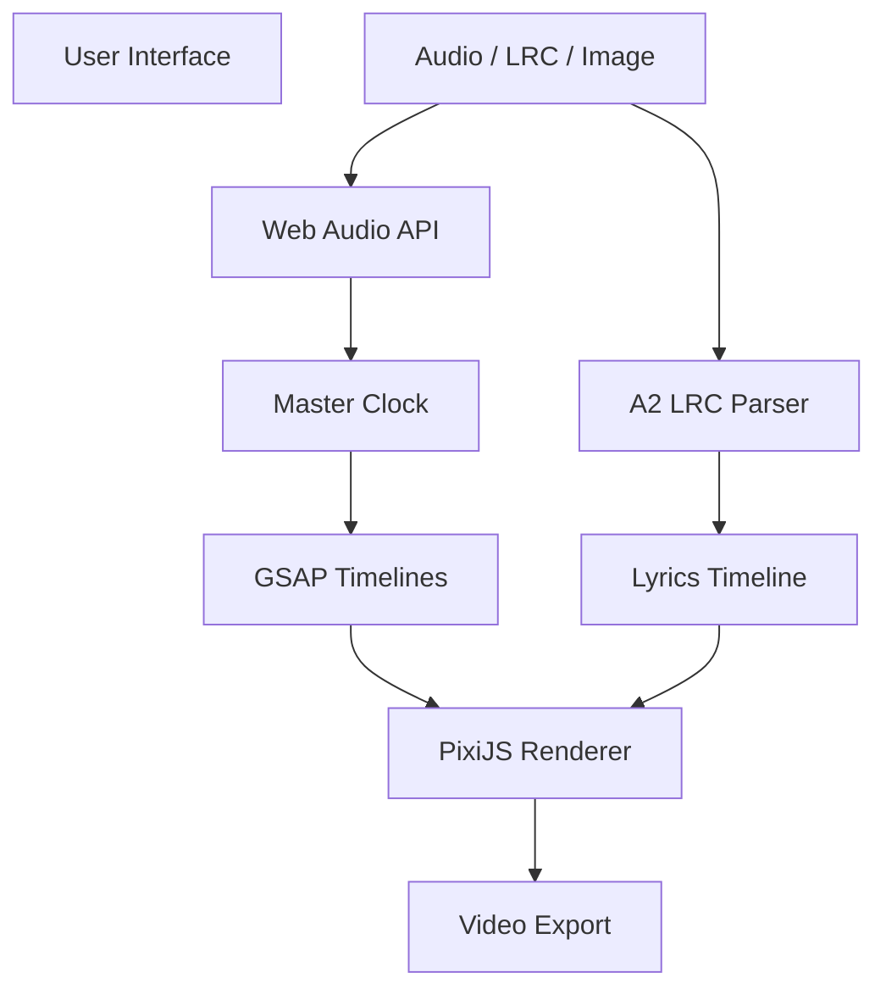

# 🎤 Karaoke Video Renderer (Client-Side)

A **fully client-side karaoke video generator** built with **PixiJS + GSAP**.  
Upload an audio file, an **A2 LRC** lyrics file, and an optional background image, then render a synchronized karaoke video directly in the browser — no server, no FFmpeg backend.

---

## ✨ Features

- 🎵 **Sample-accurate audio sync** (Web Audio API)
- 📝 **A2 LRC support** (syllable-level timing)
- 🖼️ Optional background image
- 🎬 Real-time preview
- 📦 Client-side video export (WebCodecs, MediaRecorder fallback)
- 🎨 GPU-accelerated lyric rendering (PixiJS)
- ⏱️ Timeline-driven animations (GSAP)
- 💡 Extensible karaoke effects system

---

## 🧠 How It Works (High Level)



---

## 🧱 Architecture Overview

### Core Principles

- **Single master clock** (audio-driven)
- **Deterministic rendering** for preview and export
- **Separation of concerns** (parsing, layout, animation, effects)

### Main Subsystems

| Subsystem | Responsibility |
|---------|----------------|
| Lyrics Parser | Convert A2 LRC → normalized timeline |
| Layout Engine | Compute vertical layout & center times |
| Renderer | Draw lyrics using PixiJS |
| Scroll Controller | Move lyrics bottom → top |
| Effect System | Animate syllable highlights |
| Export Pipeline | Encode frames into video |

---

## 📝 Lyrics Format (A2 LRC)

This project supports **A2 LRC**, which provides syllable-level timing:

Example:
<code>
[00:12.00]He&lt;00:12.10&gt;llo&lt;00:12.30&gt; world
</code>

Each syllable has:
- Start time
- End time
- Text content

---

## 🎨 Karaoke Effect (Default)

### Classic Left-to-Right Highlight Wipe

- Base text: gray
- Active syllables: colored
- Highlight reveal progresses linearly with time

This effect is:
- Industry-standard
- Easy to understand
- Perfectly suited for A2 LRC timing

---

## 🧩 Project Structure

```text
src/
 ├─ audio/        # Audio loading & playback
 ├─ lrc/          # A2 LRC parsing
 ├─ timeline/     # Lyrics timeline model
 ├─ renderer/     # PixiJS rendering logic
 │   ├─ lines/    # Line & syllable renderers
 │   ├─ effects/  # Karaoke effects
 │   └─ shaders/  # (Optional) custom shaders
 ├─ scroll/       # Vertical scrolling logic
 ├─ export/       # Video export pipeline
 ├─ ui/           # React UI components
 └─ state/        # Global state (Zustand)
```

---

## 🕹️ Preview vs Export

### Preview Mode
- Real-time rendering
- Audio playback enabled
- Lower resolution optional

### Export Mode
- Frame-by-frame deterministic rendering
- Driven by the same master clock
- Encoded using WebCodecs
- MediaRecorder fallback for unsupported browsers

---

## 🎥 Video Export

### Preferred
- **WebCodecs**
- High quality
- Frame-accurate

### Fallback
- **MediaRecorder**
- Wider browser support
- Less precise timing

---

## ⚙️ Configuration Options

- Video resolution (e.g. 1080p, 4K)
- FPS
- Font family & size
- Line spacing
- Colors
- Karaoke effect selection

All settings affect preview and export consistently.

---

## 🚀 Getting Started

### Prerequisites
- Modern browser (Chrome / Edge recommended)
- Node.js ≥ 18

### Install
```bash
npm install
```

### Run (Dev)
```bash
npm run dev
```

### Build
```bash
npm run build
```

---

## 🧪 Browser Support

| Browser | Preview | Export |
|-------|---------|--------|
| Chrome | ✅ | ✅ |
| Edge | ✅ | ✅ |
| Firefox | ✅ | ⚠️ Partial |
| Safari | ⚠️ | ⚠️ Experimental |

---

## 🔮 Roadmap

- SDF / MSDF text rendering
- Shader-based effects
- Beat-reactive animations
- Multiple lyric tracks
- Preset system
- WebGPU backend

---

## 🤝 Contributing

Contributions are welcome!

- Bug reports
- New karaoke effects
- Performance improvements
- Documentation updates

Please open an issue or submit a PR.

---

## 📜 License

MIT

---

## ❤️ Acknowledgements

- PixiJS
- GSAP
- Web Audio API
- WebCodecs

---

**Have fun building karaoke videos directly in the browser! 🎶**
