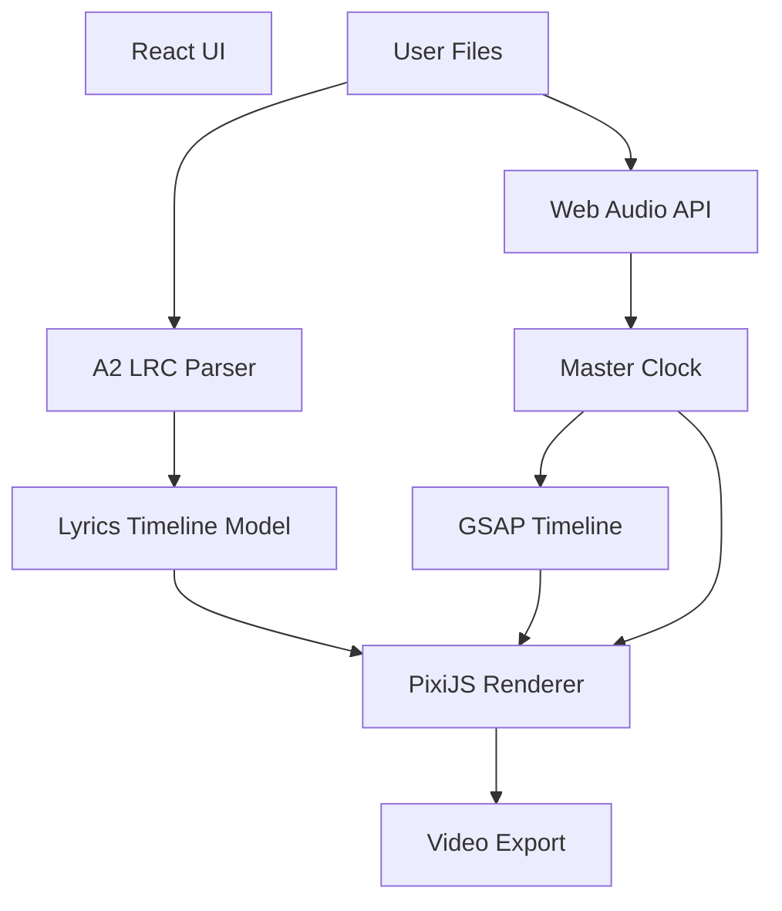
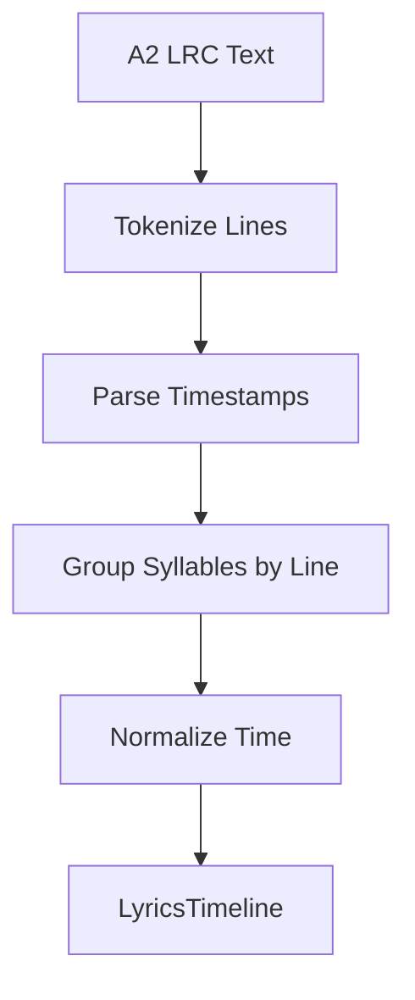
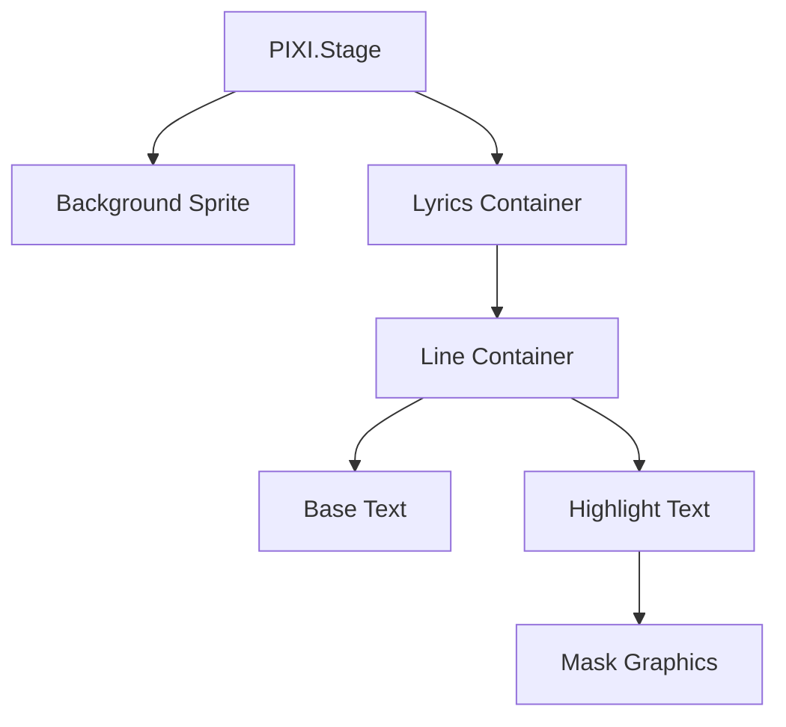
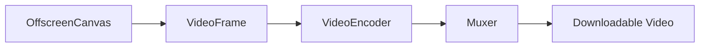

# 🎤 Client-Side Karaoke Video Renderer (PixiJS + GSAP)

## 1. Overview

This project is a **fully client-side web application** that allows users to generate karaoke-style videos by uploading:

- 🎵 An audio file
- 📝 An A2 LRC lyrics file (syllable-level timing)
- 🖼️ An optional background image
- ⚙️ Rendering settings (resolution, FPS, effects)

The application:
- Renders synchronized, animated lyrics scrolling from bottom to top
- Highlights syllables in real time using classic karaoke effects
- Allows real-time preview
- Exports a video (WebM / MP4 where supported) using browser-native APIs

No server-side processing is required.

---

## 2. Design Goals

- **Sample-accurate audio/lyric sync**
- **GPU-accelerated rendering**
- **Deterministic rendering for video export**
- **Modular, extensible animation system**
- **Offline-capable**
- **Scales from preview to 4K export**

---

## 3. Technology Stack

| Layer | Technology |
|-----|------------|
| UI | React |
| State | Zustand |
| Rendering | PixiJS (WebGL) |
| Animation | GSAP |
| Audio | Web Audio API |
| Text Rendering | PixiJS Text + masking |
| Video Export | WebCodecs + WebM/MP4 muxer |
| Fallback Export | MediaRecorder |
| File Handling | File API + ImageBitmap |

---

## 4. High-Level Architecture



---

## 5. Core Concepts

### 5.1 Master Clock

A **single source of truth for time**.

- Based on `AudioContext.currentTime`
- Drives:
  - GSAP timeline (`seek`)
  - Lyric activation
  - Rendering
  - Export frames

This prevents drift between audio and animation.

---

### 5.2 Lyrics Timeline Model

Normalized representation derived from A2 LRC.

```ts
interface Syllable {
  text: string;
  start: number;
  end: number;
  xStart?: number;
  xEnd?: number;
}

interface Line {
  text: string;
  start: number;
  end: number;
  centerTime: number;
  syllables: Syllable[];
  y?: number;
}

interface LyricsTimeline {
  lines: Line[];
  duration: number;
}
```

---

## 6. A2 LRC Parsing

### Responsibilities
- Parse timestamps at line and syllable level
- Normalize timings
- Resolve text discrepancies
- Output a `LyricsTimeline`

### Parsing Flow



---

## 7. Layout & Timing Estimation

### 7.1 Line Center Time

Defines when a line should be vertically centered.

**Default rule:**
```
centerTime = line.start
```

Alternative (optional):
```
centerTime = (line.start + line.end) / 2
```

This value drives vertical scrolling.

---

### 7.2 Vertical Layout

- All lines are stacked vertically in a single container
- Each line has a fixed height
- Initial layout is static; motion is applied globally

```ts
line.y = index * LINE_HEIGHT;
```

---

## 8. Rendering System (PixiJS)

### 8.1 Scene Structure



---

### 8.2 Line Renderer

Each line is a `PIXI.Container` containing:

- Base text (inactive color)
- Highlight text (active color)
- A mask used to reveal highlight progressively

This allows:
- Per-syllable animation
- Clean clipping
- Easy effect replacement

---

## 9. Vertical Scroll Controller

### Responsibility
Ensure that the current line is centered at its `centerTime`.

### Implementation (GSAP Timeline)

- One GSAP timeline controls `lyricsContainer.y`
- At each `line.centerTime`, container moves so the line is vertically centered

Pseudo-code:
<code>
timeline.to(lyricsContainer, {
  y: targetY,
  duration: deltaTime,
  ease: "none"
}, line.centerTime);
</code>

GSAP timeline is driven via `seek(masterTime)`.

---

## 10. Syllable Activation System

### Responsibility
Determine **when** a syllable becomes active.

- Compares `currentTime` with `syllable.start` and `syllable.end`
- Emits events:
  - `onSyllableStart`
  - `onSyllableEnd`

No rendering logic lives here.

---

## 11. Karaoke Effect System

### 11.1 Default Effect: Left-to-Right Highlight Wipe

**Industry-standard karaoke effect.**

- Base text: gray
- Highlight text: bright color
- Mask width grows linearly with time

### Implementation Strategy

- Precompute `xStart` and `xEnd` per syllable
- Animate mask width with GSAP

<code>
gsap.fromTo(mask, 
  { width: syllable.xStart },
  {
    width: syllable.xEnd,
    duration: syllable.end - syllable.start,
    ease: "none"
  }
);
</code>

---

### 11.2 Effect Extensibility

Effects are pluggable modules:

```ts
interface KaraokeEffect {
  onSyllableStart(syllable, visuals): void;
  onSyllableEnd(syllable, visuals): void;
}
```

Future effects:
- Glow pulse
- Scale bump
- Gradient wipe
- Shader-based distortions

---

## 12. Audio System

### Responsibilities
- Decode audio file
- Provide precise playback timing
- Control play / pause / seek

Implementation:
- `AudioContext`
- `AudioBufferSourceNode`

---

## 13. Preview Mode

- Real-time rendering
- GSAP + PixiJS driven by master clock
- Audio playback active
- Lower resolution optional

---

## 14. Video Export Pipeline

### 14.1 WebCodecs Pipeline



Steps:
1. Seek master clock frame-by-frame
2. Render PixiJS scene
3. Capture frame
4. Encode video
5. Mux with audio

---

### 14.2 Fallback: MediaRecorder

- Records `<canvas>` stream
- Lower precision
- Used when WebCodecs is unavailable

---

## 15. Configuration & Settings

User-adjustable:
- Resolution
- FPS
- Font family
- Font size
- Colors
- Effect selection
- Line spacing

All settings affect rendering deterministically.

---

## 16. Folder Structure

```text
src/
 ├─ audio/
 ├─ lrc/
 ├─ timeline/
 ├─ renderer/
 │   ├─ lines/
 │   ├─ effects/
 │   └─ shaders/
 ├─ scroll/
 ├─ export/
 ├─ ui/
 └─ state/
```

---

## 17. Key Advantages of This Architecture

- Deterministic rendering
- No audio/visual drift
- GPU-accelerated text animation
- Clean separation of concerns
- Easily extensible effect system
- Fully client-side & offline

---

## 18. Future Enhancements

- Shader-based text rendering (SDF)
- Per-word effects
- Beat-reactive animations
- Multiple lyric tracks
- Preset system
- WebGPU backend

---

## 19. Conclusion

This architecture mirrors professional karaoke engines while remaining fully browser-based. PixiJS + GSAP provide the right balance of performance, control, and developer ergonomics, making this system robust, extensible, and production-ready.

```
